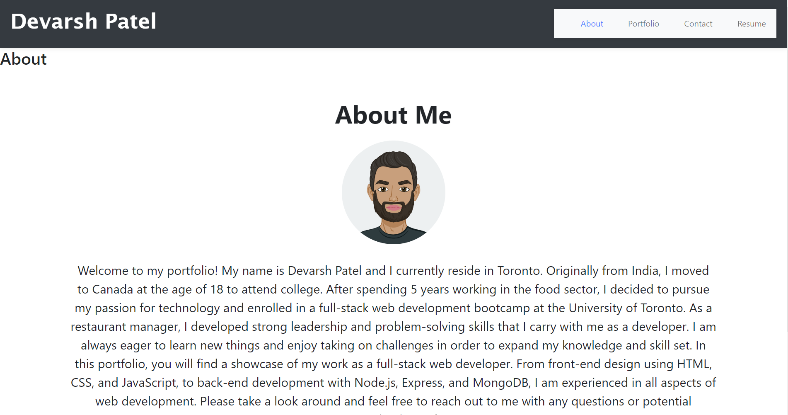

# Portfolio


[Link to my Portfolio](https://devarsh2395.github.io/Devarsh-Patel-React-Portfolio/)

## Description

Welcome to my portfolio! As a full stack web developer, I am passionate about creating innovative and intuitive web applications. With expertise in both front-end and back-end development, I am able to bring ideas to life from conceptualization to deployment.

In this portfolio, you will find a collection of projects that showcase my skills and experience. From responsive designs to interactive user interfaces, I have worked on a variety of projects that demonstrate my ability to build robust and scalable web applications.

I am experienced in using a range of technologies and tools including HTML, CSS, JavaScript, React, Node.js, and MongoDB. I strive to stay up-to-date with the latest industry trends and best practices in order to deliver the highest quality products to my clients.

Please feel free to explore my portfolio and don't hesitate to contact me if you have any questions or are interested in working together on your next project. Thank you for your interest!





## User Story

AS AN employer looking for candidates with experience building single-page applications
I WANT to view a potential employee's deployed React portfolio of work samples
SO THAT I can assess whether they're a good candidate for an open position

## Acceptance Criteria

GIVEN a single-page application portfolio for a web developer
WHEN I load the portfolio
THEN I am presented with a page containing a header, a section for content, and a footer
WHEN I view the header
THEN I am presented with the developer's name and navigation with titles corresponding to different sections of the portfolio
WHEN I view the navigation titles
THEN I am presented with the titles About Me, Portfolio, Contact, and Resume, and the title corresponding to the current section is highlighted
WHEN I click on a navigation title
THEN I am presented with the corresponding section below the navigation without the page reloading and that title is highlighted
WHEN I load the portfolio the first time
THEN the About Me title and section are selected by default
WHEN I am presented with the About Me section
THEN I see a recent photo or avatar of the developer and a short bio about them
WHEN I am presented with the Portfolio section
THEN I see titled images of six of the developer’s applications with links to both the deployed applications and the corresponding GitHub repository
WHEN I am presented with the Contact section
THEN I see a contact form with fields for a name, an email address, and a message
WHEN I move my cursor out of one of the form fields without entering text
THEN I receive a notification that this field is required
WHEN I enter text into the email address field
THEN I receive a notification if I have entered an invalid email address
WHEN I am presented with the Resume section
THEN I see a link to a downloadable resume and a list of the developer’s proficiencies
WHEN I view the footer
THEN I am presented with text or icon links to the developer’s GitHub and LinkedIn profiles, and their profile on a third platform (Stack Overflow, Twitter) 

## Table Of Contents

* [Installation](#installation)
* [Usage](#usage)
* [License](#license)
* [Contributing](#contributing)
* [Test](#test)
* [Questions](#questions)

## Installation

To install dependencies, run the following command: 

```
npm install
```

## Usage

Below is the link to the 


## Contributing


## Test


## Technologies Used

- React

## Credits

Devarsh Patel

## License

MIT License

## Questions

To ask questions about the project, contact me directly at devarsh2395@gmail.com. You can find more of my work at [devarsh2395](https://github.com/devarsh2395/).
