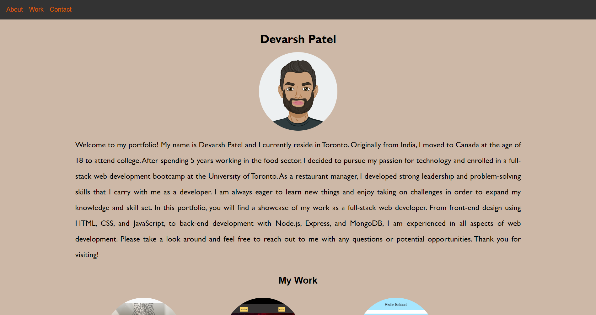

# Portfolio

[Link to my Portfolio](https://devarsh2395.github.io/Devarsh-Patel-React-Portfolio/)

## Description

Welcome to my portfolio! As a full stack web developer, I am passionate about creating innovative and intuitive web applications. With expertise in both front-end and back-end development, I am able to bring ideas to life from conceptualization to deployment.

In this portfolio, you will find a collection of projects that showcase my skills and experience. From responsive designs to interactive user interfaces, I have worked on a variety of projects that demonstrate my ability to build robust and scalable web applications.

I am experienced in using a range of technologies and tools including HTML, CSS, JavaScript, React, Node.js, and MongoDB. I strive to stay up-to-date with the latest industry trends and best practices in order to deliver the highest quality products to my clients.

Please feel free to explore my portfolio and don't hesitate to contact me if you have any questions or are interested in working together on your next project. Thank you for your interest!

## Technologies Used

- React

## Credits

Devarsh Patel

## License

MIT License

## Questions

To ask questions about the project, contact me directly at devarsh2395@gmail.com. You can find more of my work at [devarsh2395](https://github.com/devarsh2395/).
